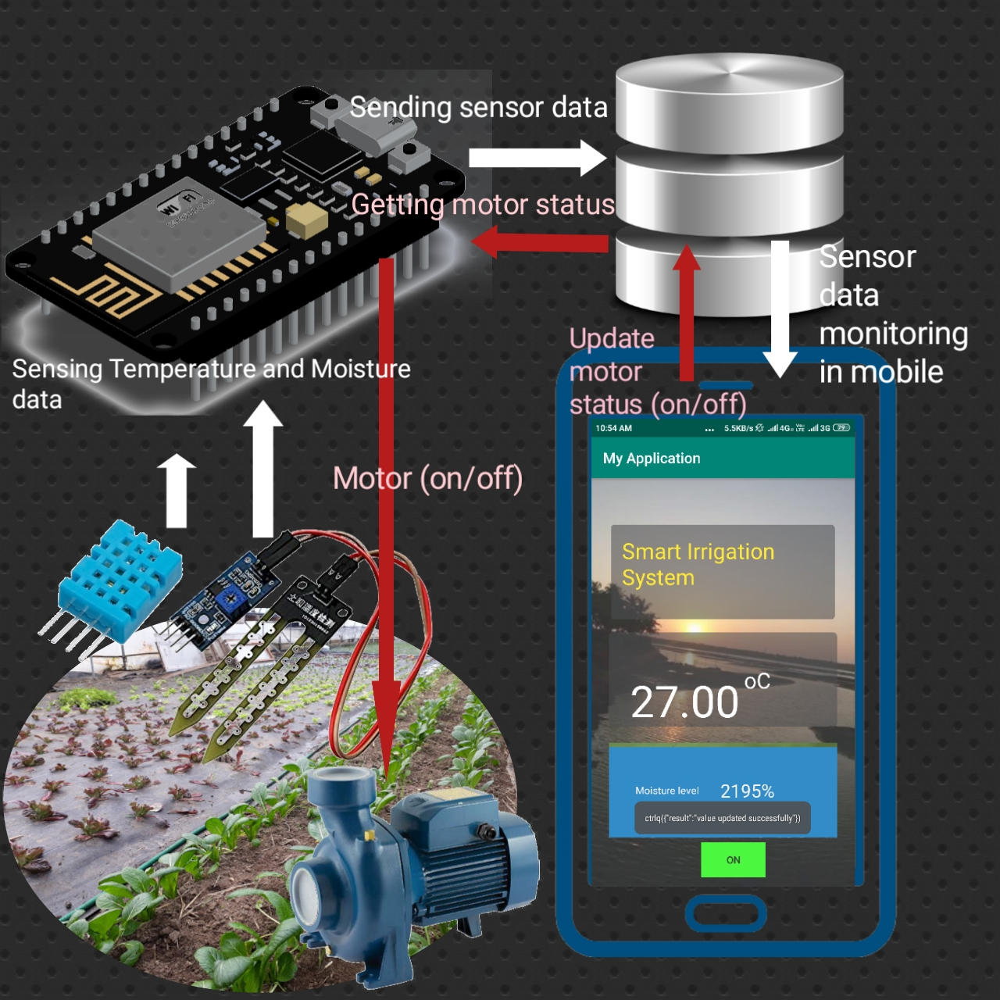
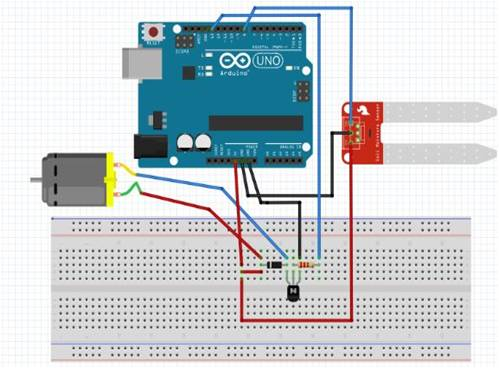
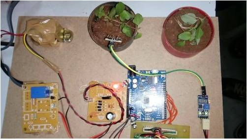
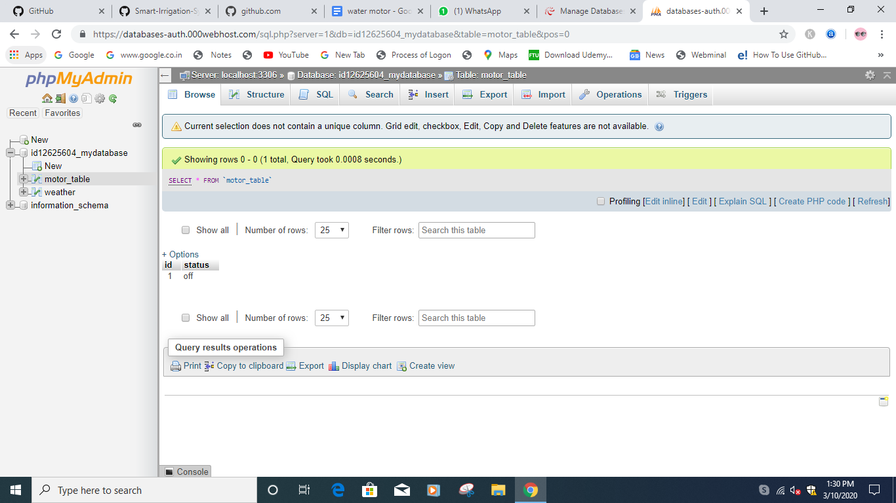
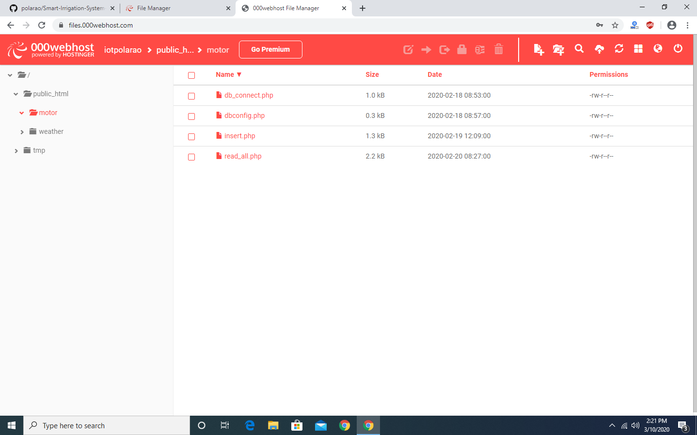
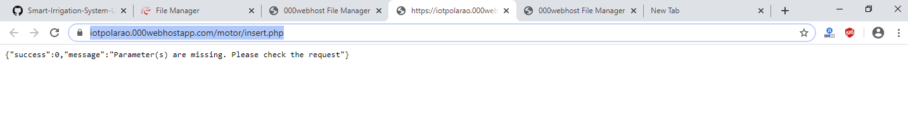

# Smart-Irrigation-System-Using-IOT-Based-On-Temperature-And-Moisture-In-Soil
Monitoring moisture content and temperature and control water pump(on/off) in android mobile
<h2>Introduction</h2>

 In India, agriculture in villages plays an essential role in developing the country. Basically, agriculture depends on the monsoons which have not enough water source. To overcome this problem, the Smart Irrigation System using IOT based on temperature and moisture in soil is employed in the field of agriculture.
 

	 In this system, based on the soil and environment conditions, the water will be provided to the agricultural field. In agriculture, there are two things, namely, the moisture content of the soil as well as environment temperature. 

<h2>Diagram</h2>

<h2>Abstract</h2>

 In the agriculture field, sensors are used like soil moisture and temperature. The information received from the sensors is sent to the Database folder through the Nodemcu(ESP8266). In the control section, the system is activated using the android application, this is finished using the ON/OFF buttons in the application.the appliction provide a facility to human intraction in the form of button for controlling motor in croft.

<h2>Existing System</h2>

Automatic Plant Watering System Using Arduino Uno

  (1)In this system, soil moisture sensor senses the moisture level of the soil.  
  (2)If soil will get dry then sensor senses low moisture level and automatically switches on the water pump to supply water to the plant. 
 (3)As plant get sufficient water and soil get wet then sensor senses enough moisture in soil. After which the water pump will automatically get stopped. 

<h2>Proposed System</h2>
<h3><a href="#psystem">Smart-Irrigation-System-Using-IOT-Based-On-Temperature-And-Moisture-In-Soil</a></h3>

 (1)With the help of this project the soil moisture and temperature can be monitored from anywhere around the world with the help of  mobile application. 
  
(2)Based on moisture content in the soil we can on or off the water pumping manually using android app.

<h2>Requirements</h2>
<ul>
  <li>Nodemcu (WiFiModule ESP8266)</li>
  <li>DHT11</li>
  <li>Soil Moisture Meter</li>
  <li>Relay</li>  
  <li>Database</li>
  <li>Android Studio</li>
  <li>Water motor</li>
</ul>

<h2>Database Tables</h2>
<h3>Motor Table</h3>

motor_table with two attributes id and status

<h3>Weather Table</h3>

weather table with id, temp, hum and mois attributes

<h2>Uploading Php api files into file directorty in server</h2>

Create two folders one for motor_table and another for weather table and then upload api files.

<h3>Copy APIs links of weather and motor php files</h3>

<h2>Connections for Nodemcu and Sensors</h2>

According to your requirement you can change pins in nodemcu(WiFiModule ESP8266)

