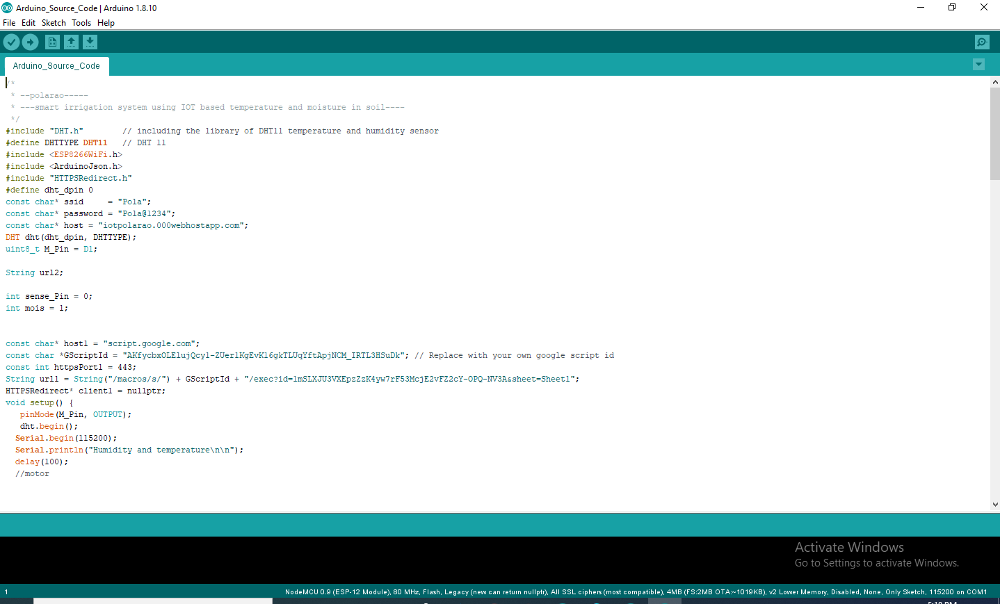

# Smart-Irrigation-System-Using-IOT-Based-On-Temperature-And-Moisture-In-Soil
Monitoring moisture content and temperature and control water pump(on/off) in android mobile
<h2>Introduction</h2>

 In India, agriculture in villages plays an essential role in developing the country. Basically, agriculture depends on the monsoons which have not enough water source. To overcome this problem, the Smart Irrigation System using IOT based on temperature and moisture in soil is employed in the field of agriculture.
 

	 In this system, based on the soil and environment conditions, the water will be provided to the agricultural field. In agriculture, there are two things, namely, the moisture content of the soil as well as environment temperature. 

<h2>Diagram</h2>

<h2>Abstract</h2>

 In the agriculture field, sensors are used like soil moisture and temperature. The information received from the sensors is sent to the Database folder through the Nodemcu(ESP8266). In the control section, the system is activated using the android application, this is finished using the ON/OFF buttons in the application.the appliction provide a facility to human intraction in the form of button for controlling motor in croft.

<h2>Existing System</h2>

Automatic Plant Watering System Using Arduino Uno

  (1)In this system, soil moisture sensor senses the moisture level of the soil.  
  (2)If soil will get dry then sensor senses low moisture level and automatically switches on the water pump to supply water to the plant. 
 (3)As plant get sufficient water and soil get wet then sensor senses enough moisture in soil. After which the water pump will automatically get stopped. 

<h2>Proposed System</h2>
<h3><a href="#psystem">Smart-Irrigation-System-Using-IOT-Based-On-Temperature-And-Moisture-In-Soil</a></h3>

 (1)With the help of this project the soil moisture and temperature can be monitored from anywhere around the world with the help of  mobile application. 
  
(2)Based on moisture content in the soil we can on or off the water pumping manually using android app.

<h2>Requirements</h2>
<ul>
  <li>Nodemcu (WiFiModule ESP8266)</li>
  <li>DHT11</li>
  <li>Soil Moisture Meter</li>
  <li>Relay</li>  
  <li>Database</li>
  <li>Android Studio</li>
  <li>Water motor</li>
</ul>

<h2>Database Tables</h2>
<h3>Motor Table</h3>

motor_table with two attributes id and status

<h3>Weather Table</h3>

weather table with id, temp, hum and mois attributes

<h2>Uploading Php api files into file directorty in server</h2>

Create two folders one for motor_table and another for weather table and then upload api files.

<h3>Copy APIs links of weather and motor php files</h3>

<h2>Connections for Nodemcu and Sensors</h2>

According to your requirement you can change pins in nodemcu(WiFiModule ESP8266)

<h2>Arduino Programming</h2>

  <pre>
  /*
 * --polarao-----
 * ---smart irrigation system using IOT based temperature and moisture in soil----
 */
#include "DHT.h"        // including the library of DHT11 temperature and humidity sensor
#define DHTTYPE DHT11   // DHT 11
#include <ESP8266WiFi.h>
#include <ArduinoJson.h>
#include "HTTPSRedirect.h"
#define dht_dpin 0
const char* ssid     = "Pola";
const char* password = "Pola@1234";
const char* host = "iotpolarao.000webhostapp.com";
DHT dht(dht_dpin, DHTTYPE); 
uint8_t M_Pin = D1;

String url2;

int sense_Pin = 0;
int mois = 1;

const char* host1 = "script.google.com";
const char *GScriptId = "AKfycbxOLElujQcy1-ZUer1KgEvK16gkTLUqYftApjNCM_IRTL3HSuDk"; // Replace with your own google script id
const int httpsPort1 = 443; 
String url1 = String("/macros/s/") + GScriptId + "/exec?id=1mSLXJU3VXEpzZzK4yw7rF53McjE2vFZ2cY-OPQ-NV3A&sheet=Sheet1";
HTTPSRedirect* client1 = nullptr;
void setup() {
   pinMode(M_Pin, OUTPUT);
   dht.begin();
  Serial.begin(115200);
  Serial.println("Humidity and temperature\n\n");
  delay(100);
  //motor
 

  
  // We start by connecting to a WiFi network

  Serial.println();
  Serial.println();
  Serial.print("Connecting to ");
  Serial.println(ssid);
  
  WiFi.begin(ssid, password);
  
  while (WiFi.status() != WL_CONNECTED) {
    delay(500);
    Serial.print(".");
  }

  Serial.println("");
  Serial.println("WiFi connected");  
  Serial.println("IP address: ");
  Serial.println(WiFi.localIP());
  Serial.print("Netmask: ");
  Serial.println(WiFi.subnetMask());
  Serial.print("Gateway: ");
  Serial.println(WiFi.gatewayIP());

  //motor
digitalWrite(M_Pin, 0);

 client1 = new HTTPSRedirect(httpsPort1);
client1->setInsecure();
client1->setPrintResponseBody(true);
client1->setContentTypeHeader("application/json");
Serial.print("Connecting to ");
Serial.println(host1); 
}

int value = 0;

void loop() {
  
  delay(500);
  ++value;

   Serial.print("MOISTURE LEVEL : ");
   mois= analogRead(sense_Pin);
   mois= mois;
   Serial.println(mois);

  Serial.print("connecting to ");
  Serial.println(host);
  
  // Use WiFiClient class to create TCP connections
  WiFiClient client;
  const int httpPort = 80;
  if (!client.connect(host, httpPort)) {
    Serial.println("connection failed");
    return;
  }
  float h=1;
  float t=1;
   h = dht.readHumidity();
    t = dht.readTemperature();
    
   //posting data to server start
  // We now create a URI for the request
  String url = "/weather/insert.php";
 
  Serial.print("Requesting URL: ");
  Serial.println(url);
  
  // This will send the request to the server
  client.print(String("GET ") + url +"?temp="+t+"&hum="+h+"&mois="+mois+" HTTP/1.1\r\n" +
               "Host: " + host + "\r\n" + 
               "Connection: close\r\n\r\n");
  delay(500);
  
  // Read all the lines of the reply from server and print them to Serial
  while(client.available()){
    String line = client.readStringUntil('\r');
    Serial.print(line);
  }
  Serial.println();
  Serial.println("closing connection");

  //post data to server end

  
  //start get motor data
 

  bool flag = false;
for (int i = 0; i < 5; i++) {
  int retval = client1->connect(host1, httpsPort1);
  if (retval == 1) {
    flag = true;
    break;
  }
  else
    Serial.println("Connection failed. Retrying...");
}
if (!flag) {
  Serial.print("Could not connect to server: ");
  
  Serial.println(host1);
  Serial.println("Exiting...");
  return;
}
Serial.println("pola");
client1->GET(url1, host1);
String str=client1->getResponseBody();
String str2=str.substring(45,47);

if(str2=="on")
{
          digitalWrite(M_Pin, 1);
          delay(100);
          Serial.println("D1 is On..!");
  }else if(str2=="of"){
          digitalWrite(M_Pin, 0);
          delay(100);
          Serial.println("D1 is Off..!");
    }
Serial.println(str2);

 delay(2000); 
 
  //end get motor data
  
}
  </pre>

I am using two different hosts one is "000webhost.com" and another one is "script.google.com"
if you would like to use same host you can choose either one that is "000webhost.com" or "script.google.com"

<h2>Android App Source Code</h2>

Open android studio and copy below code to android studio or you can open project file by downloading project files from this github space

<h3>AndroidManifest.xml</h3>

<pre>

&lt?xml version="1.0" encoding="utf-8"?&gt
&ltmanifest xmlns:android="http://schemas.android.com/apk/res/android"
   package="com.example.myapplication"&gt
&ltuses-permission android:name="android.permission.INTERNET"&gt&lt/uses-permission&gt
   &ltapplication
       android:allowBackup="true"
       android:icon="@mipmap/ic_launcher"
       android:label="@string/app_name"
       android:roundIcon="@mipmap/ic_launcher_round"
       android:supportsRtl="true"
       android:theme="@style/AppTheme"&gt
       &ltactivity android:name=".MainActivity"&gt
           &ltintent-filter&gt
               &ltaction android:name="android.intent.action.MAIN" /&gt
               &ltcategory android:name="android.intent.category.LAUNCHER" /&gt
           &lt/intent-filter&gt
       &lt/activity&gt
   &lt/application&gt
&lt/manifest&gt

</pre>

In manifest file we have to give internet permission by typing
<uses-permission android:name="android.permission.INTERNET"></uses-permission>

<h3>MainActivity.java</h3>

<pre>
package com.example.myapplication;

import androidx.annotation.RequiresApi;
import androidx.appcompat.app.AppCompatActivity;
import android.app.DownloadManager;
import android.graphics.Color;
import android.os.Build;
import android.os.Bundle;
import android.os.CountDownTimer;
import android.util.Log;
import android.view.View;
import android.widget.Button;
import android.widget.TextView;
import android.widget.Toast;
import com.android.volley.Request;
import com.android.volley.RequestQueue;
import com.android.volley.Response;
import com.android.volley.VolleyError;
import com.android.volley.toolbox.JsonObjectRequest;
import com.android.volley.toolbox.StringRequest;
import com.android.volley.toolbox.Volley;
import org.json.JSONArray;
import org.json.JSONException;
import org.json.JSONObject;
import java.util.Locale;
import me.itangqi.waveloadingview.WaveLoadingView;
public class MainActivity extends AppCompatActivity {

   WaveLoadingView waveLoadingView;
   Button ofButton;
   private static final long START_TIME_IN_MILLIS = 10000000;
   private CountDownTimer mCountDownTimer;
   private boolean mTimerRunning;
   private long mTimeLeftInMillis = START_TIME_IN_MILLIS;
   TextView textView,textView1;
   @Override

protected void onCreate(Bundle savedInstanceState) {
       super.onCreate(savedInstanceState);
       setContentView(R.layout.activity_main);
       waveLoadingView=findViewById(R.id.waveLodingView);
       waveLoadingView.setProgressValue(0);
       textView=(TextView)findViewById(R.id.temp);
       textView1=(TextView)findViewById(R.id.mois);
       ofButton=(Button)findViewById(R.id.button);
        startTimer();
       updateCountDownText();
   }

   public void jsonAndWater(){
       RequestQueue requestQueue;
       requestQueue= Volley.newRequestQueue(this);
       JsonObjectRequest jsonObjectRequest=new JsonObjectRequest(Request.Method.GET, "https://iotpolarao.000webhostapp.com/weather/read_all.php", null, new Response.Listener<JSONObject>() {
           @RequiresApi(api = Build.VERSION_CODES.KITKAT)
           @Override
           public void onResponse(JSONObject response) {
               JSONArray jsonArray=response.optJSONArray("weather");
               JSONObject jsonObject=jsonArray.optJSONObject(0);
               String moistures=jsonObject.optString("mois");
               String temp=jsonObject.optString("temp");
               int moisturei=Integer.parseInt(moistures);
               waveLoadingView.setProgressValue(moisturei);
               textView.setText(temp);
               textView1.setText(moistures+"%");
           }
       }, new Response.ErrorListener() {
           @Override
           public void onErrorResponse(VolleyError error) {
               Log.d("myapp","wrong");
           }
       });
       requestQueue.add(jsonObjectRequest);
   }
   private void startTimer() {
       mCountDownTimer = new CountDownTimer(mTimeLeftInMillis, 1000) {
           @Override
           public void onTick(long millisUntilFinished) {
               mTimeLeftInMillis = millisUntilFinished;
               updateCountDownText();
           }
           @Override
           public void onFinish() {
               mTimerRunning = false;
           }
       }.start();
       mTimerRunning = true;

   }
   private void updateCountDownText() {
       int minutes = (int) (mTimeLeftInMillis / 1000) / 60;
       int seconds = (int) (mTimeLeftInMillis / 1000) % 60;
       String timeLeftFormatted = String.format(Locale.getDefault(), "%02d:%02d", minutes, seconds);
       jsonAndWater();

   }

   public void motorControl(View view) {
       RequestQueue requestQueue;
       requestQueue= Volley.newRequestQueue(this);
       String s=null;
       String bs=ofButton.getText().toString();
       if(bs.equals("on")){
           ofButton.setText("off");
           ofButton.setBackgroundColor(Color.parseColor("#FB1515"));
           s="on";
       }else if(bs.equals("off")){
           ofButton.setText("on");
           ofButton.setBackgroundColor(Color.parseColor("#20F610"));
           s="off";
       }
       String url="https://script.google.com/macros/s/AKfycbxupQvf7Q_TfuN2ITE4en0cjfv1nzRtNDJ5rCFBjzOKPfaDmXw/exec?callback=ctrlq&status="+s+"&id=1&action=update";
       StringRequest stringRequest = new StringRequest(Request.Method.GET, url,
               new Response.Listener<String>() {
                   @Override
                   public void onResponse(String response) {
                       // Display the first 500 characters of the response string.
                       Toast.makeText(MainActivity.this,response,Toast.LENGTH_LONG).show();
                   }
               }, new Response.ErrorListener() {
           @Override
           public void onErrorResponse(VolleyError error) {
               Toast.makeText(MainActivity.this,"failed",Toast.LENGTH_LONG).show();
           }
       });
// Add the request to the RequestQueue.
       requestQueue.add(stringRequest);

   }
}
</pre>

